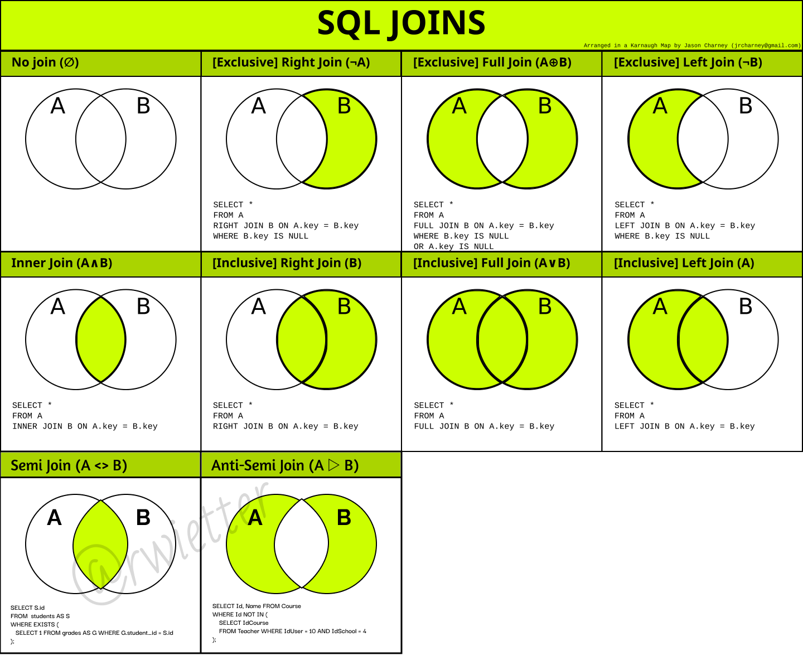

<div align="center">
    <h2>JOIN</h2>
</div> 



---

```sql
Table A       Table B
id name       id  name
-- ----       --  ----
1  Pirate     1   Rutabaga
2  Monkey     2   Pirate
3  Ninja      3   Darth Vader
4  Spaghetti  4   Ninja
```

**INNER JOIN:** *juntar duas ou mais tabelas por chaves correspondentes.*

```sql

```

**LEFT JOIN:** *permite obter não apenas os dados relacionados de duas tabelas, mas também os dados não relacionados encontrados na tabela à esquerda da cláusula JOIN.*
    
```sql

```
    
**LEFT OUTER JOIN**: produz um conjunto completo de registros da Tabela A, com os registros correspondentes (quando disponíveis) na Tabela B. Se não houver correspondência, o lado direito conterá nulo.
    
```sql
SELECT * FROM TableA
LEFT OUTER JOIN TableB
ON TableA.name = TableB.name

-- result
id  name       id    name
1   Pirate     2     Pirate
2   Monkey     null  null
3   Ninja      4     Ninja
4   Spaghetti  null  null

--------------------------------
-- Sem valores ta tabela B
SELECT * FROM TableA
LEFT OUTER JOIN TableB
ON TableA.name = TableB.name
WHERE TableB.id IS null

-- result
id  name       id     name
2   Monkey     null   null
4   Spaghetti  null   null
```
    
**RIGHT JOIN: a***o contrário do LEFT JOIN, a cláusula RIGHT JOIN retorna todos os dados encontrados na tabela à direita de JOIN.*

```sql

```

**FULL JOIN:** *juntar o poder das junções (Join) internas (Inner), a listagem de todas as outras linhas não associadas, tanto do lado direito (Right) da junção como do lado esquerdo (Left). Não é suportado pelo Mysql.*

```sql

```

**FULL OUTER JOIN**: produz o conjunto de todos os registros na Tabela A e na Tabela B, com registros correspondentes de ambos os lados, quando disponíveis. Se não houver correspondência, o lado ausente conterá null.
    
```sql
SELECT * FROM TableA
FULL OUTER JOIN TableB
ON TableA.name = TableB.name

-- result
id    name       id    name
1     Pirate     2     Pirate
2     Monkey     null  null
3     Ninja      4     Ninja
4     Spaghetti  null  null
null  null       1     Rutabaga
null  null       3     Darth Vader
```
    
**SEMI JOIN**: *são joins que retornam linhas de uma tabela A baseado na existência de linhas correlacionadas em uma tabela B. Se a consulta retorna apenas atributos (campos) da tabela da esquerda, então o join é chamado de Left Semi Join; se retorna apenas atributos da tabela da direita, então é chamado de Right Semi Join. Um semi join pode ser produzido usando INNER JOINS, EXISTS, IN e também com o INTERSECT.*
    
```sql
-- recuperar todos os clientes que já realizaram compras na empresa com IN
SELECT
    c.ClienteID,
    c.Nome,
    c.Sobrenome
FROM
    dbo.Clientes c
WHERE
    c.ClienteID IN (
    SELECT
        v.ClienteID
    FROM
        dbo.Vendas v
    )

-- recuperar todos os clientes que já realizaram compras na empresa com EXISTS
SELECT
    c.ClienteID,
    c.Nome,
    c.Sobrenome
FROM
    dbo.Clientes c
WHERE
    EXISTS (
    SELECT
        1
    FROM
        dbo.Vendas v
    WHERE
        v.ClienteID = c.ClienteID
    )
```
    
**ANTI-SEMI JOIN**: *ocorre quando linhas em uma tabela A não possuem correspondentes em uma tabela B (é baseado na não-existência). É possível alcançar um anti-semi join através de subconsultas utilizando NOT IN ou EXISTS, ou ainda através do operador EXCEPT. Também é possível alcançar um anti-semi join utilizando outer join, filtrando somente as outer rows.*
    
```sql
-- 1) Usando NOT IN
SELECT
    c.ClienteID,
    c.Nome,
    c.Sobrenome
FROM
    dbo.Clientes c
WHERE
    c.ClienteID NOT IN (
    SELECT
        v.ClienteID
    FROM
        dbo.Vendas v
    )

-- 2) Usando NOT EXISTS
SELECT
    c.ClienteID,
    c.Nome,
    c.Sobrenome
FROM
    dbo.Clientes c
WHERE
    NOT EXISTS (
    SELECT
        1
    FROM
        dbo.Vendas v
    WHERE
        v.ClienteID = c.ClienteID
    )
```