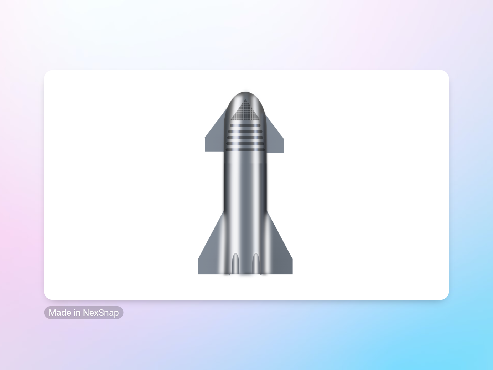

<h1 align="center">
  <a href="https://rwietter.github.io/css-drawing-starship/">CSS Drawing Starship</a>
</h1>

<p align="center">
This is a simple project to draw a starship using CSS.
</p>

<div align="center">
  
</div>

## 🚀 Quick start

1.  **Start developing.**

    Clone the project with git clone and

    Navigate into your new site’s directory and start it up.

    ```shell
    cd css-drawing-starship/
    code .
    ```

    Open with live server...

    Your site is now running at `http://localhost:8000`!


## 🧐 What's inside?

A quick look at the top-level files and directories

    .
    ├── .vscode
    ├── assets
    ├── .gitignore
    ├── index.html
    ├── LICENSE
    ├── README.md
    ├── styles.css
    ├── styles.scss
